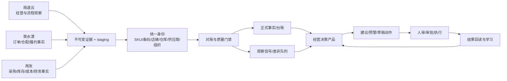

# 简道云 × 聚水潭 × 用友：数据融合与组织蓝图

日期：2026-08-12  
目标：把三个系统组织成一条可解释、可复核、可逐步自动化的数据神经系统，而不是把三份数据粗暴合并成第四个数据孤岛。

## 1. 战略结论

三个系统不应互相替代，它们分别回答不同问题：

- **简道云**：业务现场看到了什么、人工流程发生了什么、平台经营信号如何变化；
- **聚水潭**：电商订单、仓库、出库、退货与平台履约实际发生了什么；
- **用友**：组织、供应商、物料、采购、入库、成本、凭证与财务账确认了什么。

系统的核心价值不是“把数据都搬进来”，而是用同一身份、同一时间轴和同一口径把三种证据对齐，
持续回答四个问题：**需求是真的吗、货在哪里、承诺能兑现吗、最终赚到并收回现金了吗。**

## 2. 当前实证基线

| 来源 | 当前可用证据 | 当前阻塞 | 现在允许做什么 |
|---|---|---|---|
| 简道云 | 14 条已选只读契约在运行；第 15 条天猫费用候选已核对字段/时效并在代码中登记，但默认关闭 | 仍有大量平台 SKU 未映射；销售/费用控制总量、UAT、放行未完成 | 做趋势、退款、覆盖率和未映射优先队列；天猫费用只能做渠道级核对，不得冒充全渠道/SKU 成本 |
| 聚水潭 | 客户端、签名、token、契约、失败留痕已具备 | 部署出口 IP 白名单；部分 API 权限 | 保留恢复/探针；未解锁前不声明库存/出库事实可用 |
| 用友 | token 握手、只读客户端、8 条白名单契约、失败不重试规则已具备 | 8 条 API 尚未授权；租户/组织 ID 未取得；同步关闭 | 只做配置/授权体检；不得声明业务数据已接通 |

决策工作室「能力解锁」现由服务端实时组装四源证据矩阵，不再只显示静态契约。
2026-08-12 对生产 PostgreSQL 做只读运行（无外部 API 调用、无 staging 写入、无游标变更），得到：

| 来源 | 证据状态 | 成功流 | 源行 | Staging | 拒收 | 身份观察 / 开放异常 | 业务截止 |
|---|---:|---:|---:|---:|---:|---:|---|
| SCM 受控事实 | 已放行 | 0 | 6,068 个核心记录 | 不适用 | 0 | 5,376 SKU / 不适用 | 内部当前事实 |
| 简道云 | 仅观察 | 15 | 103,117 | 102,820 | 0 | 305 / 305 | 2023-04-07 → 2026-08-11 |
| 聚水潭 | 仅契约 | 0 | 0 | 0 | 0 | 0 / 0 | 未取得 |
| 用友 | 仅契约 | 0 | 0 | 0 | 0 | 0 / 0 | 未取得 |

「源行」是每个连接器每条流的最新成功批次合计；目录、schema 或其他控制流可以只留证据而不进 staging，
所以简道云 297 行差额不能自动解读为丢数；只有「拒收」和每流控制总量对账才是异常判定依据。
聚水潭是固定客户端契约，无需手选契约；页面已与「0 条契约」语义分开。

2026-08-13 再次运行真实只读探针，外部门禁未发生漂移：聚水潭店铺/仓库/库存仍返回 `190`，
出库仍返回 `110`；用友 token 仍成功，8 条只读契约仍为 0/8（`310037`）。探针不写 staging、
不推进游标，也不把鉴权成功冒充业务数据可用。

2026-08-14 又对生产 PostgreSQL 做了跨系统身份只读核验。该核验按来源 scope 和身份类型去重，
不输出外部原值，也不写入 staging、异常队列或游标：

| 来源 | SKU/条码 | 仓库 | 供应商 | 渠道 | 店铺 | 组织 | 业务单号 |
|---|---:|---:|---:|---:|---:|---:|---:|
| 简道云 | 0/295，待认领 | 0/4，待认领 | 0/9，待认领 | 无候选 | 未实现 | 未实现 | 无对照 |
| 聚水潭 | 无候选 | 无候选 | 无候选 | 无候选 | 未实现 | 未实现 | 无对照 |
| 用友 | 无候选 | 无候选 | 无候选 | 无候选 | 未实现 | 未实现 | 无对照 |

分母只包含已经进入受控身份管道的候选；“无候选”不能证明源端不存在该实体。每个数据产品现会
按来源声明必需身份维度，流状态、时效、行数均通过后仍须逐维度通过身份门禁才可达到 A1。
店铺和组织需要独立主档及精确外部 ID 映射；业务单号需要逐流候选总量和未匹配队列。少量已有
`external_doc_refs` 也只能算部分证据，不能凭“已登记数=已观察数”伪报 100% 覆盖。

为避免“同一来源某条流产生过候选，就替另一条没有解析身份的流放行”，身份门禁现拆成两层：

1. **逐流提取契约**：每条必需流必须显式登记该身份为已进入治理、尚未提取、待真实结构画像或
   当前契约不可提供；缺登记和没有适用流均默认拒绝；
2. **来源级认领覆盖**：只有第一层通过后，才检查该来源作用域候选是否全部精确认领/对照。

当前静态事实为：简道云 15 条已实现读取流和 1 条目标流均已登记；聚水潭 4 条已实现与 2 条目标流
均已登记；用友 8 条白名单读取流与 1 条目标应收流均已登记。拼多多商家编码仍是未冻结命名空间；
平台店铺和多数单号未进入治理；聚水潭库存是 `SKU × 全聚水潭仓汇总`，不能提供仓库身份；用友八流
仍只保存不可变原始响应，在授权真实样本与字段画像评审前全部保持「待真实结构画像」。这些状态已
进入能力解锁表、动态修复队列、安全 CSV 和 `data-product-release/v4` 范围指纹；契约变化自动使旧
批准失效。登记只描述代码可达性，不证明当前账号权限、运行成功、控制总量或业务 UAT 已完成。

本轮运行证据显示，简道云最新三个天猫流为：

- 日销量：54,740 行，业务截止 2026-08-11；
- 退款：37,839 行，业务截止 2026-08-11；
- SKU 对照：3,434 行；
- 销售平台身份 1,868 个，其中 443 个已映射；销售行 54,740 行，其中 14,388 行已映射。
- 最新对照批次中，482 个未映射身份已有条码并进入简道云作用域认领队列；另有 1,938 个
  对照身份缺条码。按支付件数排序的 TOP 30 中，4 个可直接认领、26 个需回源补平台
  SKU–条码对照。

这些数字是“最新运行批次观察”，不是正式账本；后续批次会变化，页面必须同时显示截止日、覆盖率和门禁。

同日对生产 PostgreSQL 的新“三平台身份控制塔”做只读核验（未写 staging、未推进游标）：

| 平台 | 截止 | 源行 | 唯一平台身份 | 已映射 | 身份覆盖 | 桥接字段覆盖 | 质量门禁 |
|---|---:|---:|---:|---:|---:|---:|---|
| 天猫 | 2026-08-04 | 3,434 | 3,433 | 1,013 | 29.5% | 条码 43.5% | 1 行缺业务键 |
| 拼多多 | 2026-08-11 | 6,266 | 5,979 | 0 | 0.0% | 商家 SKU 编码 100%（仅观察） | 37 个重复键组；编码命名空间未确认 |
| 唯品会 | 2026-08-11 | 413 | 413 | 166 | 40.2% | 条码 100% | 覆盖低于 80% 运营门槛 |

三平台合计 10,113 行、9,825 个平台唯一身份、1,179 个已映射身份，加权覆盖 12.0%。该合计只用于
衡量身份修复工作量，不能解释为 9,825 个系统 SKU，也不能跨平台去重；各平台仍必须单独通过
身份、总量、时效和 UAT 门禁。

身份控制塔已进一步把汇总变成可执行队列：每个平台从最新成功批次确定性选出最多 20 条，按
“多 SKU/桥接冲突 → 有唯一桥但未映射 → 缺桥 → 重复来源”排序。天猫和唯品会的唯一条码可精准
进入人工认领；拼多多商家 SKU 编码继续只作观察，必须先由业务确认命名空间，不能因为字段填充率
高就自动等同 SCM 编码。队列可导出为中文行动清单，并逐行保留来源截止、问题、证据、动作与
`observation_only` 门禁。

同一生产只读快照下，确定性待修工作量为 8,646 个平台身份：天猫 2,420、拼多多 5,979、
唯品会 247。页面只返回每平台优先 20 条（共 60 条）作为行动队列，完整工作量仍保留在平台汇总，
避免把“只显示 60 条”误解为“只剩 60 条”。

决策工作室现可直接导出两份受控 UAT 证据：一份按日列出支付、退款、净需求与已映射净需求，
一份列出 TOP 未映射平台 SKU、异常单 ID 和下一步动作。两份 CSV 均逐行携带来源/对照截止、
`observation_only` 权限口径和放行状态；外部文本经过 spreadsheet formula injection 防护。
导出只是让业务对账可执行，不代表控制总量已经验收或数据已经升格为正式事实。

## 3. 数据分层：一条数据只能有一个角色

| 层 | 内容 | 可否改写 | 主要用途 |
|---|---|---:|---|
| L0 原始证据 | 文件 hash、最小化 API 信封、请求范围、游标 | 否 | 审计、重放、争议回溯 |
| L1 Staging | 标准化行、来源字段、身份解析结果、错误 | 只按新批次追加/替代 | 校验、人工裁决、对账 |
| L2 统一身份 | SKU/条码/平台 SKU、店铺/渠道、仓库、供应商、组织映射 | 人工或受控规则 | 跨系统连接；禁止模糊自动认领 |
| L3 正式事实 | 销售、订单、库存、收发存、采购、成本、凭证 | 受 release/posting 控制 | 经营口径与财务口径 |
| L4 数据产品 | 需求脉搏、供给承诺、库存位置、毛利现金等 | 可重算、版本化 | 看板、预警、情景分析 |
| L5 动作与学习 | 建议、草稿单、审批、执行结果、偏差原因 | 有审计的人机协同 | 闭环和模型校准 |

关键纪律：L0/L1 的“看见”不等于 L3 的“确认”；L4 可以同时使用正式事实与观察信号，
但必须分色、分口径并显示覆盖率，不能在 SQL 中悄悄混成一个数字。

## 4. 统一身份图

| 实体 | 系统主键 | 外部身份 scope | 自动匹配允许条件 |
|---|---|---|---|
| SKU | `skus.id` | `JIANDAOYUN` / `JST` / `YONYOU` | 来源 scope + 类型 + 值精确唯一 |
| 条码 | `sku_identifiers` | 来源 scope | 合法格式且唯一命中；冲突即停 |
| 店铺/渠道 | `channels.id` | 平台 + 店铺 | 精确映射；店铺名不能直接当渠道编码 |
| 仓库 | `warehouses.id` | 来源仓库编码 | 来源编码精确唯一；不按名称猜 |
| 供应商 | `suppliers.id` | 用友/JST/文件 | 外部编码或人工确认别名 |
| 组织 | 后续组织映射 | `YONYOU` | 租户 + 组织 ID；禁止只用名称 |
| 单据 | 来源系统 + 单据类型 + 单号 | 来源固定 | 复合键幂等；不得跨来源只按单号合并 |
| 批次 | 来源 + 仓库 + SKU + 批号 | 来源固定 | 必须保留真实批号；缺失不能造默认批次 |

身份修复不应平均处理，而应按业务杠杆排序：未映射支付件数最高的 SKU；同时出现在退款、
库存或在途中的 SKU；Hero SKU/新品/临期/断货风险 SKU；唯一条码可证明的项；最后才是长尾。

决策工作室的新“外部需求信号”页已按支付件数生成 TOP 30 队列。每行同时显示条码和异常状态：
有开放异常时按 `scope=JIANDAOYUN + aliasType=sku_barcode + rawValue=完整条码` 精确跳转认领；
缺条码时明确进入“回源补对照/条码”队列。认领仍由人裁决，系统不猜，也不改写旧 staging；
认领后必须重新同步“天猫 SKU 对照”，由新不可变批次取得系统 SKU 归属。

决策工作室的“平台身份覆盖”页进一步把天猫、拼多多、唯品会三个最新成功对照批次放入同一
控制塔，但仍按各平台自己的业务键分别计算。页面显示源行、唯一身份、系统 SKU 映射率、桥接
字段覆盖、新鲜度、重复组和冲突映射，并把所有平台保持为 `observation_only / 禁止放行`。
拼多多商家 SKU 编码已实证与 SCM 编码属于不同命名空间，因此只显示可用率，不进行模糊匹配。

## 4.1 三条身份修复队列

| 队列 | 判定 | 系统动作 | 人工动作 | 退出条件 |
|---|---|---|---|---|
| Q1 可直接认领 | 唯一条码 + `open` 异常 | 精确定位异常并按需求量排序 | 选择唯一系统 SKU | scoped alias 已写入，新对照批次解析成功 |
| Q2 源端补齐 | 平台 SKU 无条码/无对照 | 保留店铺、平台 SKU、名称与需求量证据 | 在简道云/平台主档补正确条码或对照 | 新源批次出现唯一条码并转入 Q1/自动唯一命中 |
| Q3 冲突裁决 | 同一键出现多个条码或多个系统 SKU | 停止自动归属并显示冲突 | 数据 owner 查原单/包装层级后裁决 | 冲突消失且审计记录完整 |

## 5. 十一个可复用的数据产品

| 系统内可执行目录 | 作用 |
|---|---|
| `src/components/data-products.ts` | 统一登记下表每个产品的决策、粒度、来源、owner、目标权威级和放行门禁；决策工作室「能力解锁」页可直接查看 |

目录只定义目标契约，不存储密钥，也不代替运行时就绪度。聚水潭、用友未通过实际对账/UAT 时，
目录中依赖它们的产品仍必须留白或降级为观察。

| 数据产品 | 三方组合 | 决策 | 生产门禁 |
|---|---|---|---|
| 平台身份控制塔 | 简道云平台对照 + SCM SKU/条码 + 后续 JST 身份 | 哪些平台身份阻塞对账和自动化 | 最新批次、唯一键、精确桥、冲突清零、覆盖阈值、UAT |
| 需求脉搏 | 简道云支付/退款 + JST 出库/退货 | 真实净需求、活动峰谷 | 身份覆盖、时间窗对齐、退款口径 |
| 订单到现金 | JST 订单/履约 + 用友凭证/回款 | 渠道净收入与现金回收 | 订单-发票-凭证三方对账 |
| 统一库存位置 | JST 仓存 + 用友现存量 + 系统台账 | 可用量、差异、覆盖缺口 | 仓库映射、截止日、账实差阈值 |
| 供给承诺 | 用友 PO/入库 + JST 到货/出库 + 简道云流程 | ETA、欠交、承诺可信度 | 单号身份、数量/单位、状态映射 |
| 净毛利桥 | 简道云平台费用 + JST 销售成本 + 用友存货成本 | SKU/渠道贡献利润 | 成本期间、退款、平台费完整度 |
| 供应商 360 | 用友供应商/PO/入库 + 系统质量/交期 | OTIF、质量、价格、风险 | 供应商身份、承诺日、样本量 |
| 补货证据包 | 需求脉搏 + 统一库存 + 在途 + MOQ/周期 | 建议量、建议日、风险 | 正式库存优先；观察信号不得单独下单 |
| 新品上市雷达 | 简道云/NPD 流程 + 用友采购 + JST 首销 | 上市准备度与首销兑现 | 里程碑事件、首单和上市日一致 |
| 异常三角核对 | 简道云观察 vs JST 运营 vs 用友财务 | 找漏单、迟记、口径漂移 | 每边独立显示，不自动“调平” |
| 经营/现金 S&OP | 上述产品聚合 | 13 周销量、供给、库存、现金 | 指标注册、版本、负责人、关账状态 |

当前已落地的第一条跨源计算为「简道云净需求 × 聚水潭实际出库」：简道云先按支付减成功退款
保留观察值，再按已映射 SCM SKU 与聚水潭日出库做共同业务日比较。输出必须同时携带可比覆盖、
单边尾部、差异、来源截止和 UAT 门禁；没有共同键时返回数据不足而不是 0。当前只在跨店铺、跨仓
汇总粒度成立，待真实租户 UAT 和店铺/仓身份治理后再下钻，不能提前宣称完整目标粒度已实现。

供给承诺的下一条基线已在 SCM 内部落地：对已到期、唯一 `PO × SKU` 行分列计算原始承诺与当前
承诺下的按期足量、迟到补齐和逾期未齐；采购单位转换为基础单位，质检接收和采购退货按各自业务
事件日形成可重放净接收轨迹。供应商首承诺和再次改期与 PO 更新处于同一事务，逐行追加到数据库
不可变版本链；迁移前日期只标为遗留当前快照，不倒推原始承诺。无交期、未来、窗口外、重复 SKU
行、事件净额与当前已收控制量不一致都单列排除。该基线为未来简道云人工流程、JST 仓配入库和
用友 PO/入库建立同口径对照插槽，但当前不把三条未验收外部边并入率值，也不因“内部可算”把
供给承诺产品升为 A1/A2。

组合决策不重复解释底层事实。产品图按「平台身份 → 需求/订单 → 毛利」「供给 → 供应商」、
「身份 + 需求 + 供给 → 新品」「需求 + 库存 + 供给 + 订单到现金 → 异常三角」逐层复用；
补货证据包只消费需求脉搏、统一库存位置和供给承诺，经营/现金 S&OP 再叠加净毛利桥。
已由上游验收的外部流不在下游重复登记。依赖进入下游证据指纹，上游撤回、换版或实时门禁
失效会让所有下游自动降级，并在行动队列指向首个上游门禁。数据资产覆盖图保留直接消费与
间接下游影响两种关系，既能看到一条源流影响多少决策，也不会把间接复用误算为重复取数。

## 6. Agentic 设计：逐级授权

| 等级 | 系统行为 | 适用场景 |
|---|---|---|
| A0 观察 | 显示趋势、覆盖、差异、时效 | 新来源刚接入 |
| A1 解释 | 给出确定性拆解和证据链接 | 退款上升、库存差异 |
| A2 建议 | 生成排序后的行动建议与原因 | 认领、补货、催交 |
| A3 草稿 | 生成 PO/调拨/通知草稿，等待人审 | 可逆且规则稳定的动作 |
| A4 受控执行 | 在金额、SKU、仓库、时窗上限内执行 | 通过 UAT、回滚和权限验收后 |

每次动作必须携带证据批次、业务截止日、覆盖率、口径版本、触发规则、禁止条件、审批人和
结果回读。外部连接失败、数据过期、映射覆盖骤降时自动降级到 A0。

### 6.1 A2/A3 产品级放行闭环

目录、运行证据和人工批准现在分成三层，避免“有代码”“跑成功一次”和“允许用于建议/草稿”混为一谈：

1. `data-products.ts` 固化产品版本、owner role、必需来源/流、指标和自动化上限；
2. 实时门禁逐流检查配置、时效、状态、源行、拒收、空源与 SCM 产品专属事实，只能自动达到 A0/A1；
3. `data_product_releases` 登记控制总量证据、业务 UAT、回滚方案和适用范围，并要求同责任域另一名审批人会签。

批准绑定产品版本、必需流和连接范围指纹。应用、租户、组织、契约或启用能力改变时，旧批准自动失效；
正常日常批次刷新只要仍满足质量和时效门，就无需反复审批。最新批次失败、过期、拒收、空源或授权异常时，
有效能力立即退回 A0/A1。责任人可随时撤回，全部动作与审计同事务。当前目录最高只允许 A3，A4 不在本轮授权范围。

## 7. 动态运营机制

### 每日

- 检查三方连接器最后成功时间、行数变化、游标与错误码；
- 按当前证据自动重排十一个数据产品的行动队列：失效放行先止损，再处理待会签、可验收放行、证据修复和已放行监控；
- 生成高价值未映射身份队列；
- 对支付、退款、出库、库存、PO/入库做异常检测；
- 只把需要人处理的项推入工作台/飞书，避免告警噪声。

### 每周

- 复核映射覆盖增量、数据过期、重复/冲突和跨系统差异；
- 评估建议采纳率、误报率与处理时长；
- 结果反馈写入只追加、可纠正的产品级台账，并固定绑定当时放行和来源范围，避免模型/契约变化倒灌历史；
- 校准阈值，但不自动改财务/库存口径。

### 每月

- 冻结指标版本和关账证据；
- 对账简道云经营观察、JST 履约事实、用友财务事实；
- 复盘预测偏差、供应商承诺、库存资金、退款和毛利桥。

## 8. 执行路线与完成定义

### Wave 1：现在可完成

- [x] 简道云三流按最新成功批次聚合；旧批次不重复累加；
- [x] 支付件数减成功退款，非法数字单独计数；
- [x] 展示行/身份/数量三种映射覆盖率；
- [x] 建立天猫/拼多多/唯品会身份控制塔，分别显示最新批次、新鲜度、桥接率、重复和冲突；
- [x] 将三平台缺口收口为确定性优先修复队列，每平台最多 20 条并可导出行动清单；
- [x] 生成高销量未映射 TOP 30 队列并进入认领工作流；
- [x] 将条码、异常状态和完整原始值精准链接到认领页；
- [x] 区分“可认领”与“必须回源补对照/条码”，认领后要求新批次重解析；
- [x] 页面明确标记 observation-only，禁止进入正式销售/补货；
- [x] 生成日控制总量与身份修复两份安全 CSV，携带来源截止、覆盖率、质量和放行状态；
- [x] 将天猫账单费用项目汇总登记为字段最小化只读契约，完成 12,624 行真实演练与幂等重放；
- [x] 将最新费用批次接入毛利页财务 UAT 预览：按币种、月份、店铺、费用项展示计费/支付/
  差额/负数冲销，并导出带运行、任务、截止日、控制总量和门禁的安全 CSV；
- [ ] 财务以天猫平台账单核对行数、币种、69 类费用项、冲销负数和净额，通过后才把费用流加入定时选择；
- [x] 动态汇总 SCM/简道云/聚水潭/用友的契约、成功流、截止日、行数、身份异常和 UAT 门禁；
- [x] 为十一个数据产品逐来源声明必需身份维度，把身份契约纳入放行指纹，并在展开页、动态行动
  队列和安全 CSV 披露 SKU/仓库/供应商/渠道/店铺/组织/业务单号的实际门禁；生产只读核验保持
  简道云未认领候选以及聚水潭/用友无证据状态为 A0；
- [x] 为全部简道云/聚水潭/用友已实现及产品目标流建立逐流身份提取契约，把“是否真的入治理”与
  “来源候选是否已认领”分成双门禁；未知流、无适用流、缺仓库粒度、未提取和待真实结构画像均
  fail-closed，并进入 UI、行动队列、安全 CSV 与放行指纹；
- [x] 为每个数据产品的每条必需外部流登记实际使用的业务语义：粒度、业务时间、编码命名空间、
  数量单位、币种/金额精度、正负号、状态、库存范围和纠错/冲销；未登记、待业务复核、待真实结构
  画像或契约不提供均 fail-closed。能力解锁页按流紧凑展示，行动队列给出确定性复核动作，签核 CSV
  保留状态/粒度/说明/下一步，发布指纹绑定语义范围；
- [x] 为十一个数据产品的全部指标逐产品登记计算血缘：输出粒度、真实输入、连接键、缺失处理、
  实现状态、实证与下一步；只有 `implemented` 可通过 A1，局部实现、待实现或缺契约一律 fail-closed。
  指标输入只能引用产品已声明的流、SCM 事实或上游产品；能力解锁页、行动队列和签核 CSV 均可回查，
  `data-product-release/v6` 将指标集合与稳定血缘范围纳入批准指纹；
- [x] 建立供给承诺 SCM 内部版本化可重放基线：按唯一 `PO × SKU`、原始/当前承诺日、基础单位、
  质检接收与采购退货事件计算按期足量/迟到补齐/逾期未齐；供应商承诺与改期只追加，遗留快照不
  冒充原始值；重复行和控制量不一致 fail-closed，图表、例外表与 CSV 同时披露版本/计算覆盖和
  三条外部 UAT 门禁。由于三方对照尚未完成，指标保持 partial；
- [x] 建立外部数据资产到业务决策的反向覆盖图：每条简道云/聚水潭/用友流去重关联依赖产品、决策、Owner、SLA 和放行级；分开可解释与运营就绪，并暴露已读取未编入产品的流；
- [x] 将数据资产用途拆成「放行依赖」与「辅助证据」：把简道云采购需求、库存盘点、仓库、
  调拨、供应商和样品管理 6 条旧观察流嵌入相应产品，但不让过期辅助资料阻塞放行或替代正式事实；
- [x] 在每个数据产品的展开证据和签核 CSV 中逐行展示辅助流的时点、运行、数量、限制及
  「不参与放行」标记，使历史资料真正可用于回查而不污染共同截止和自动化判断；
- [x] 将 6 条简道云旧观察流的最新成功批次转成白名单历史聚合：采购需求/完成、盘盈盘亏、
  仓容、调拨确认、供应商字段完整度、样品收货与检验；只输出聚合与历史期间，不输出原始身份、
  联系方式、授信、银行或单据值，也不跨批次累计、不补零、不参与 A1/A2/A3；
- [x] 为上述历史聚合增加 `JIANDAOYUN` 作用域身份覆盖：按 SKU/供应商/仓库披露已认领、待认领、
  已入队和未入队数，并直达精准认领队列；已修复采购需求 `supplier` 字段漏队并重跑 60 行真实批次，
  当前六条辅助流的未认领候选均已入队、未入队数为 0；继续保留人工认领门禁，不用内部主码/GLOBAL
  同值静默合并；
- [x] 为十一个数据产品按产品所需具体流动态计算「来源/所需流缺失 / 来源齐但未放行 / 来源已放行」，不用无关成功流代替；
- [x] 将所需流继续细分为当前、过期、受限和缺失，逐流披露业务截止、SLA、最新运行、源行、Staging、拒收与 abstain 原因；
- [x] 计算每个产品的共同可比截止、最新来源日期、跨源跨度与缺日期数；缺业务日期保持 A0，不以近期同步时间代替源业务时点；
- [x] 导出当前「产品 × 所需流」决策证据包，统一携带契约、Owner/SLA、共同截止、逐流质量、放行与下一步行动，供 UAT/会签复用；
- [ ] 业务逐项认领高价值平台 SKU；
- [ ] 业务在源端补齐高价值缺条码平台 SKU，并重新同步对照批次；
- [ ] 以平台导出控制总量完成简道云 UAT。

### Wave 2：聚水潭解锁后

- [ ] 加入部署出口 IP 白名单并完成所需只读 API 授权；
- [ ] 由聚水潭确认淘系/拼多多的奇门或平台专用订单、售后授权及商家路由；标准订单接口排除淘系/拼多多、标准售后只含自有商城，不得冒充全渠道目标；
- [ ] 用真实小窗口跑订单/出库/退货/库存契约；
- [ ] 与简道云需求信号做日期、店铺、SKU 三维对账；
- [ ] 通过重放、限流、超时、空窗和恢复 UAT；
- [ ] 达标后才把相应流提升为运营事实输入。

### Wave 3：用友解锁后

- [ ] 授权 8 条只读 API，读取租户/组织 ID；
- [ ] 在目标 YonBIP 租户官方 API 目录确认应收、收款与核销的精确只读契约后，再实现应收结算流；不得按名称猜测路径或字段；
- [ ] 先接组织/供应商/物料，再接 PO/入库/库存，最后接成本/凭证；每流先以有界无值画像评审真实字段；
- [x] 同契约版本跨批比对结构指纹；漂移保留原始证据/staging 但持久阻断放行，不会连续出现后自动解封；
- [x] 按精确运行导出 admin-only 无值字段映射评审表，保留技术键并提供业务语义/目标字段/单位/缺失语义/用途/审核人待填列；
- [ ] 为每流建立控制总量与增量游标；
- [ ] 做 PO→入库→库存→成本/凭证的链路对账；
- [ ] 财务与库存放行必须由指定责任人审批。

### Wave 4：闭环智能

- [x] 发布十一个数据产品的指标契约、owner、刷新节奏、决策 SLA、版本、A2/A3 上限和护栏；
  页面动态计算当前 A0/A1，运行证据不能替代产品级 UAT 越级；v1.0.1 起每个产品还必须命中
  自身的非空 SCM 受控事实键及相应业务时点/有效状态门限，全局 SCM 健康状态、过期快照或
  已关闭周期不能替产品专属数据作证；
- [x] 建立产品级 A2/A3 放行台账：控制总量、UAT、双人会签、范围指纹、实时自动降级、审计与立即撤回；
- [x] 将目录、逐流证据、产品放行和决策 SLA 合成动态行动队列；不伪造精确价值分，并把技术流键转成中文业务名称。
- [x] 为动态队列生成受门禁约束的行动入口：精确展开产品契约、仅在商品身份流受阻时按来源进入人工认领、放行后进入既有业务分析页；不另造重复工作台。
- [x] 建立数据产品真实结果台账与决策工作室学习指标：采用/修改/拒绝/暂缓、后验结果、误报、处理时长、节省工时和受权限保护的现金影响；只追加纠正、同事务审计、缺失不补零，也不自动升 A4。
- [ ] 将补货、催交、认领、库存核对升级到 A2/A3；
- [ ] 累积足量真实样本并经业务 UAT 后，以采用率、误报率、节省工时和现金改善决定是否另行批准 A4；
- [x] 任一门禁失败自动降级，不能“带病自动化”：除失败、过期、拒收、空源、授权/时间异常和
  范围指纹变化外，底层放行门还显式绑定连接器当前状态；历史成功流不能替
  `contract_only` / `blocked` 状态续命 A1/A2/A3。两批同步后由门禁看门狗把失效放行按产品
  幂等开单、按 ownerRoles 通知并直达门禁；恢复自动关闭，再次失效另留新证据。

完成的定义不是“接口返回 200”，而是同时满足：凭据和最小权限、契约、不可变证据、
身份覆盖、控制总量、时效、失败恢复、UAT、负责人、可回滚和持续监控。

### 当前可执行顺序（按依赖而非按系统平均推进）

| 顺序 | 工作包 | Owner | 系统已准备的证据/工具 | 完成证据 |
|---:|---|---|---|---|
| 1 | 简道云 TOP 30 身份修复 | 商品/电商运营 + PMC | 决策工作室精准队列、身份修复 CSV、别名认领页 | 新对照批次覆盖提升，旧批次未改写 |
| 2 | 简道云控制总量 UAT | 电商数据 owner + 财务 | 需求日控制量 CSV + 天猫费用币种/月/店铺/费用项控制表，均携带运行、截止、覆盖、质量和门禁 | 同截止日平台导出行数/数量/退款/费用净额一致或差异已解释；财务签认后才选中费用流 |
| 3 | 聚水潭出库最小窗口 | 聚水潭管理员 + IT | 签名客户端、只读探针、失败留痕 | 固定出口 IP 入白名单，真实出库小窗可重放且总量一致 |
| 4 | 聚水潭库存观察 | 仓储 owner | 显式 opt-in 总量增量契约 | API 权限、可信仓范围和缺失未知语义通过 UAT |
| 5 | 用友组织/主档观察 | 用友管理员 + 财务 | 8 条白名单只读契约、310037 分类、有界无值字段画像、跨批漂移硬闸、按 run 映射评审 CSV | API 授权后取得 tenant/org，以真实结构画像和评审表确认映射；无漂移或漂移已审批升版，组织/供应商/物料控制量一致 |
| 6 | 用友业务/财务链路 | 采购 + 财务 | PO/入库/库存/成本/凭证观察 staging | PO→入库→库存→成本/凭证差异闭环并审批 |
| 7 | 三角对账与 A2 建议 | PMC + 财务 | 简道云需求、JST 履约、用友财务三边证据 | 时间窗/身份/单位统一，差异有 owner、原因和 SLA |

## 9. 文件与信息的组织方式

- 源文件：保留在受控源目录，数据库记录路径、hash、截止日和导入批次；
- 需求/会议：归 `docs/spec`，当前生效结论收口到 `CURRENT.md`；
- 数据审计/血缘/融合：归 `docs/data`，本目录 README 是唯一导航；
- 外部接口/授权/UAT：归 `docs/integrations`，当前状态只在 `EXTERNAL-SYSTEMS.md` 更新；
- 运行手册：归 `docs/guides`；
- 历史方案：归 archive/skill-history，不冒充当前状态；
- 密钥：只存受保护环境变量，任何 Markdown、日志、Git 历史都不得出现。

这套组织方式允许未来增加平台或新文件而不改核心架构：新增来源只需登记契约、scope、
身份规则、权威等级、SLA、控制总量和允许用途，即可接入同一条受控路径。
